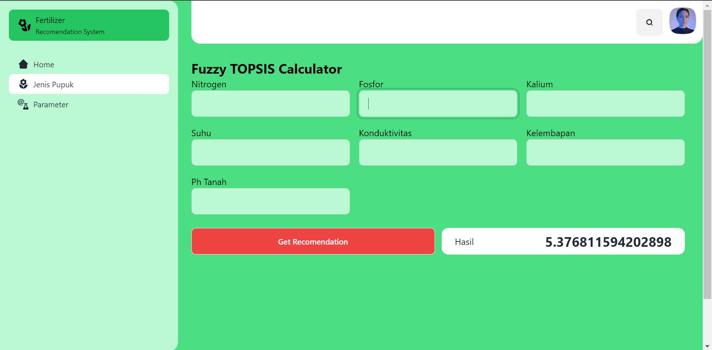

# Fertilizer Recomendation System
## How to install
<!-- Install python instruction -->
1. Download and install Python 3.9 from [Python's official site](https://www.python.org/downloads/).
2. Verify the installation by opening a command prompt and typing `python --version`. You should see the Python version that you installed.
3. Install pip, which is a package manager for Python. It usually comes with Python. You can check if it's installed by typing `pip --version` in the command prompt.

### Download & Install the project
1. Clone the project from the repository using the command `git clone https://github.com/khulqu15/fuzzy_flask` or just download this project.
2. Open command prompt / terminal.
3. Navigate to the project directory using `cd /path/to/fuzzy_flask`.
4. Install the required packages using `pip install -r requirements.txt`.
5. Run the project using `python app.py`.

# Screenshot Project
